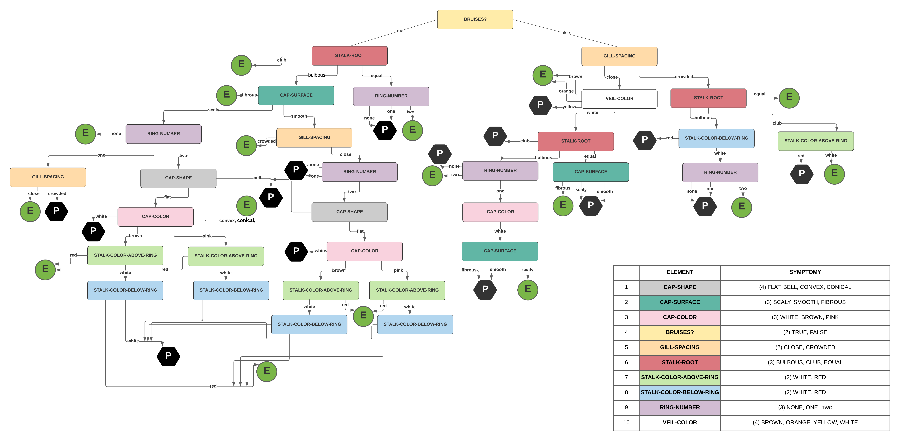

# SE-AGH

This repository contains a Prolog project for the Expert Systems course at AGH University of Science and Technology (2020/2021).

## Mushroom edibility evaluation system

The knowledge used by the system is based on the [Mushroom dataset](https://archive.ics.uci.edu/ml/datasets/mushroom) from the UCI Machine Learning Repository. It was simplified using a C4.5 decision tree.

### Predicate tree

### Bibliography

Dua, D. and Graff, C. (2019). UCI Machine Learning Repository [http://archive.ics.uci.edu/ml]. Irvine, CA: University of California, School of Information and Computer Science.
